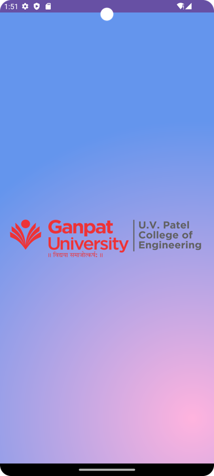
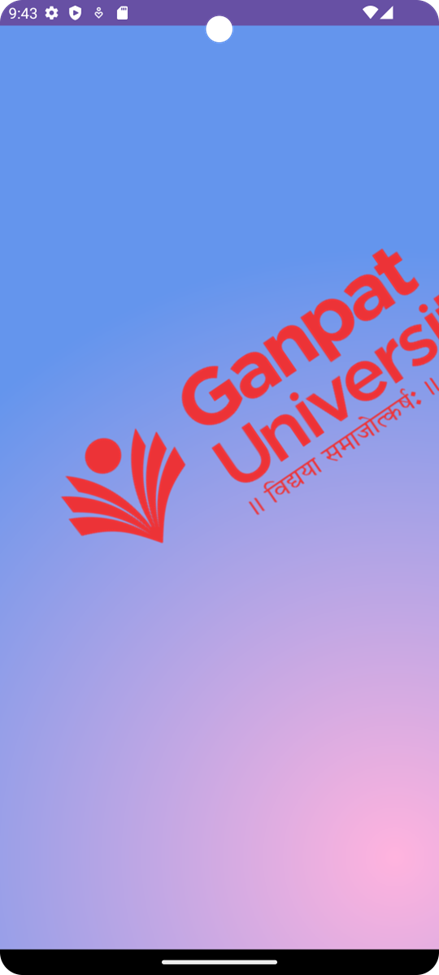
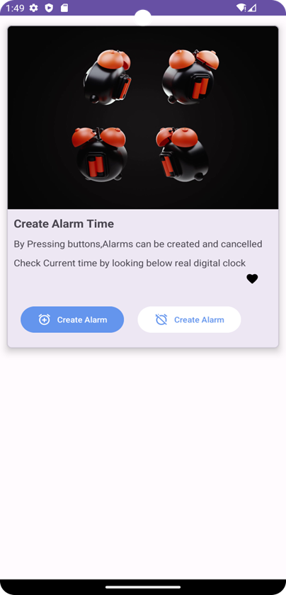
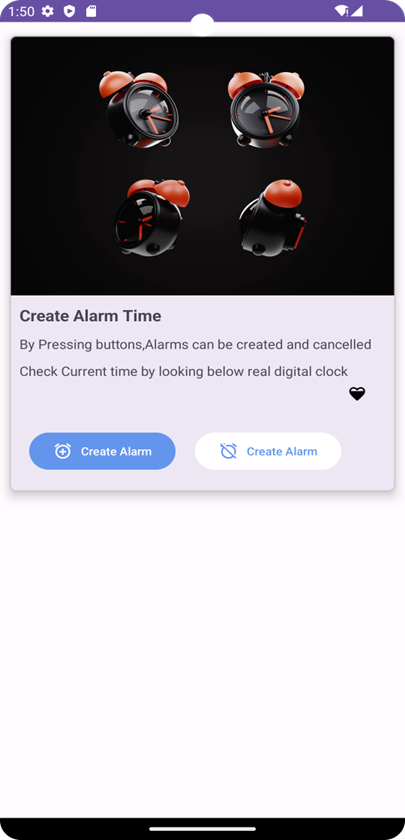

# Practical 9 - Frame by Frame Animation and Twin Animation

This repository contains an Android application that demonstrates frame by frame animation and twin animation. It consists of two activities, SplashActivity and MainActivity, each showcasing different animations.

- Submitted By: MAKWANA SWASTIK PRAVIN
- Enrollment number: 21012011046

## Practical Details

### AIM: 
What is Frame by Frame Animation? What is Twin Animation? How can you achieve edge-to-edge content display in your app? Create Android Application to demonstrate Frame by frame animation and splash screen to demonstrate twin animation according to below instructions.

## Application Overview

### SplashActivity
SplashActivity displays a splash screen with a gradient background and a logo animation. The animation is achieved using frame-by-frame animation followed by twin animation. It transitions to the MainActivity once the animations are completed.

### MainActivity
MainActivity demonstrates frame by frame animation with two different animations, alarm and heart. It displays alarm and heart animations as images on the screen.

## User Interface
The user interface for both activities is defined in XML layout files as follows:

- `activity_main.xml`: Layout for the MainActivity, showing alarm and heart animations.
  
  ``` xml
  <?xml version="1.0" encoding="utf-8"?>
  <androidx.constraintlayout.widget.ConstraintLayout xmlns:android="http://schemas.android.com/apk/res/android"
    xmlns:app="http://schemas.android.com/apk/res-auto"
    xmlns:tools="http://schemas.android.com/tools"
    android:layout_width="match_parent"
    android:layout_height="match_parent"
    tools:context=".MainActivity">

    <LinearLayout
        android:layout_width="match_parent"
        android:layout_height="match_parent"
        android:orientation="vertical"
        app:layout_constraintStart_toStartOf="parent"
        app:layout_constraintEnd_toEndOf="parent"
        app:layout_constraintTop_toTopOf="parent"
        app:layout_constraintBottom_toBottomOf="parent">
        <androidx.core.widget.NestedScrollView
            android:layout_width="match_parent"
            android:layout_height="match_parent">
            <com.google.android.material.card.MaterialCardView
                android:layout_width="match_parent"
                android:layout_height="wrap_content"
                android:layout_marginTop="15dp"
                android:layout_marginBottom="15dp"
                android:layout_marginStart="10dp"
                android:layout_marginEnd="10dp"
                app:cardCornerRadius="7dp"
                app:cardElevation="7dp">

                <LinearLayout
                    android:layout_width="match_parent"
                    android:layout_height="match_parent"
                    android:orientation="vertical">
                    <ImageView
                        android:layout_width="match_parent"
                        android:layout_height="742px"
                        android:id="@+id/imagealarm"
                        />
                    <TextView
                        android:layout_width="match_parent"
                        android:layout_height="wrap_content"
                        android:text="Create Alarm Time"
                        android:textSize="17sp"
                        android:textStyle="bold"
                        android:layout_marginTop="10dp"
                        android:layout_marginStart="10dp"/>
                    <TextView
                        android:layout_width="match_parent"
                        android:layout_height="wrap_content"
                        android:text="By Pressing buttons,Alarms can be created and cancelled"
                        android:layout_marginTop="10dp"
                        android:paddingEnd="10dp"
                        android:layout_marginStart="10dp"/>
                    <TextView
                        android:layout_width="match_parent"
                        android:layout_height="wrap_content"
                        android:text="Check Current time by looking below real digital clock"
                        android:layout_marginTop="10dp"
                        android:paddingEnd="10dp"
                        android:layout_marginStart="10dp"/>

                    <ImageView

                        android:id="@+id/image_heart"
                        android:layout_width="27dp"
                        android:layout_height="27dp"
                        android:layout_marginTop="2dp"
                        android:layout_marginEnd="25dp"
                        android:layout_gravity="right" />
                    <LinearLayout
                        android:layout_width="wrap_content"
                        android:layout_height="wrap_content"
                        android:orientation="horizontal"
                        android:layout_marginStart="10dp"
                        android:layout_marginTop="15dp"
                        android:layout_marginBottom="10dp">
                        <com.google.android.material.button.MaterialButton
                            android:layout_width="wrap_content"
                            android:layout_height="wrap_content"
                            app:cornerRadius="20sp"
                            android:text="Create Alarm"
                            android:textSize="12sp"
                            android:layout_margin="10dp"
                            app:icon="@drawable/baseline_alarm_add_24"
                            app:iconSize="20sp"
                            android:backgroundTint="@color/blue"/>
                        <com.google.android.material.button.MaterialButton
                            android:layout_width="wrap_content"
                            android:layout_height="wrap_content"
                            app:cornerRadius="20sp"
                            android:text="Create Alarm"
                            android:textSize="12sp"
                            android:layout_margin="10dp"
                            app:icon="@drawable/baseline_alarm_off_24"
                            app:iconSize="20sp"
                            android:backgroundTint="@color/white"
                            android:textColor="@color/blue"
                            app:iconTint="@color/blue"/>
                    </LinearLayout>
                </LinearLayout>
            </com.google.android.material.card.MaterialCardView>
        </androidx.core.widget.NestedScrollView>
    </LinearLayout>
  </androidx.constraintlayout.widget.ConstraintLayout>
  
  ```
- `activity_splash.xml`: Layout for the SplashActivity, displaying the splash screen with a logo animation.
  
  ``` xml
  <?xml version="1.0" encoding="utf-8"?>
  <androidx.constraintlayout.widget.ConstraintLayout xmlns:android="http://schemas.android.com/apk/res/android"
    xmlns:app="http://schemas.android.com/apk/res-auto"
    xmlns:tools="http://schemas.android.com/tools"
    android:layout_width="match_parent"
    android:layout_height="match_parent"
    tools:context=".SplashActivity"
    android:background="@drawable/rectangle_gradient">
    <ImageView
        android:id="@+id/uvpce"
        android:layout_width="match_parent"
        android:layout_height="100dp"
        app:layout_constraintBottom_toBottomOf="parent"
        app:layout_constraintEnd_toEndOf="parent"
        app:layout_constraintStart_toStartOf="parent"
        app:layout_constraintTop_toTopOf="parent"/>

  </androidx.constraintlayout.widget.ConstraintLayout>
  ```
  
## Animation Resources

The frame-by-frame animations are defined in the following XML files:

- `Alarm_animation_list.xml`: Animation list for alarm images.
  ``` xml
  <?xml version="1.0" encoding="utf-8"?>
  <animation-list  xmlns:android="http://schemas.android.com/apk/res/android" android:oneshot="false">
    <item android:drawable="@drawable/alarm1" android:duration="200"/>
    <item android:drawable="@drawable/alarm2" android:duration="200"/>
    <item android:drawable="@drawable/alarm3" android:duration="200"/>
    <item android:drawable="@drawable/alarm4" android:duration="200"/>
    <item android:drawable="@drawable/alarm5" android:duration="200"/>
    <item android:drawable="@drawable/alarm6" android:duration="200"/>
    <item android:drawable="@drawable/alarm7" android:duration="200"/>
    <item android:drawable="@drawable/alarm8" android:duration="200"/>
    <item android:drawable="@drawable/alarm9" android:duration="200"/>
    <item android:drawable="@drawable/alarm10" android:duration="200"/>
  </animation-list>
  ```
- `Heart_animation_list.xml`: Animation list for heart images.
  ``` xml
  <?xml version="1.0" encoding="utf-8"?>
  <animation-list xmlns:android="http://schemas.android.com/apk/res/android" android:oneshot="false">
    <item android:drawable="@drawable/ic_heart_0" android:duration="200"/>
    <item android:drawable="@drawable/ic_heart_25" android:duration="200"/>
    <item android:drawable="@drawable/ic_heart_50" android:duration="200"/>
    <item android:drawable="@drawable/ic_heart_75" android:duration="200"/>
    <item android:drawable="@drawable/ic_heart_100" android:duration="200"/>
  </animation-list>
  ```
- `Logo_animation_list.xml`: Animation list for the logo image.
  ``` xml
  <?xml version="1.0" encoding="utf-8"?>
  <animation-list xmlns:android="http://schemas.android.com/apk/res/android" android:oneshot="false">
    <item
        android:drawable="@drawable/uvpce_logo"
        android:duration="100" />

    <item
        android:drawable="@drawable/uvpce_logo_1"
        android:duration="100" />

    <item
        android:drawable="@drawable/uvpce_logo_2"
        android:duration="100" />

    <item
        android:drawable="@drawable/uvpce_logo_3"
        android:duration="100" />

    <item
        android:drawable="@drawable/uvpce_logo_4"
        android:duration="200" />

    <item
        android:drawable="@drawable/uvpce_logo_5"
        android:duration="100" />

    <item
        android:drawable="@drawable/uvpce_logo_6"
        android:duration="200" />

    <item
        android:drawable="@drawable/uvpce_logo_7"
        android:duration="100" />
    </animation-list>
  ```

The twin animation is defined in the `Twin_animation.xml` file.
``` xml
<?xml version="1.0" encoding="utf-8"?>
<set xmlns:android="http://schemas.android.com/apk/res/android">
    <scale
        android:fromXScale="1.0"
        android:fromYScale="1.0"
        android:toXScale="2.0"
        android:toYScale="2.0"
        android:duration="750"
        android:pivotX="50"
        android:pivotY="50"
        android:startOffset="750"/>
    <translate
        android:fromXDelta="1.0"
        android:fromYDelta="1.0"
        android:toXDelta="10.0"
        android:toYDelta="100.0"
        android:duration="750"
        android:startOffset="750"/>
    <rotate
        android:fromDegrees="0"
        android:toDegrees="360"
        android:pivotY="50"
        android:pivotX="50"
        android:duration="1500"
        android:startOffset="750"
        />

</set>
```

The gradient background for the SplashActivity is defined in `Rectangle_gradient.xml`.

``` xml
<?xml version="1.0" encoding="utf-8"?>
<shape xmlns:android="http://schemas.android.com/apk/res/android" android:shape="rectangle">
<gradient
    android:startColor="@color/pink"
    android:endColor="@color/blue"
    android:type="radial"
    android:gradientRadius="1500"
    android:centerX="0.9"
    android:centerY="0.9"/>
</shape>
```

## Kotlin Code
The app's logic is implemented in Kotlin with the following main classes:

- `SplashActivity.kt`: Controls the SplashActivity and manages frame-by-frame and twin animations.
  ``` kotlin
  package com.example.p9

  import android.content.Intent
  import android.graphics.drawable.AnimationDrawable
  import androidx.appcompat.app.AppCompatActivity
  import android.os.Bundle
  import android.view.animation.Animation
  import android.view.animation.Animation.AnimationListener
  import android.view.animation.AnimationUtils
  import android.widget.ImageView

  class SplashActivity : AppCompatActivity(), Animation.AnimationListener {

    private lateinit var frameAnimation: AnimationDrawable
    private lateinit var logoImage: ImageView
    private lateinit var twinAnimation: Animation

    override fun onCreate(savedInstanceState: Bundle?) {
        super.onCreate(savedInstanceState)
        setContentView(R.layout.activity_splash)

        logoImage = findViewById(R.id.uvpce)
        logoImage.setBackgroundResource(R.drawable.logo_animation_list)

        frameAnimation = logoImage.background as AnimationDrawable
        twinAnimation = AnimationUtils.loadAnimation(this, R.anim.twin_animation)
        twinAnimation.setAnimationListener(this)
    }

    override fun onWindowFocusChanged(hasFocus: Boolean) {
        super.onWindowFocusChanged(hasFocus)
        if (hasFocus) {
            // Start the frame-by-frame animation
            startFrameAnimation()
        } else {
            frameAnimation.stop()
        }
    }

    private fun startFrameAnimation() {
        if (frameAnimation.isRunning) {
            frameAnimation.stop()
        }
        frameAnimation.start()

        // Calculate the duration of the frame-by-frame animation
        val frameAnimationDuration = calculateFrameAnimationDuration(frameAnimation)

        // Schedule the twin animation to start after the frame-by-frame animation finishes
        logoImage.postDelayed({
            logoImage.startAnimation(twinAnimation)
        }, frameAnimationDuration)
    }

    private fun calculateFrameAnimationDuration(animationDrawable: AnimationDrawable): Long {
        val frameCount = animationDrawable.numberOfFrames
        var duration = 0L
        for (i in 0 until frameCount) {
            duration += animationDrawable.getDuration(i)
        }
        return duration
    }

    override fun onAnimationStart(p0: Animation?) {
        // Code for onAnimationStart, if needed
    }

    override fun onAnimationEnd(p0: Animation?) {
        // Animation has finished in the SplashActivity
        // Start the MainActivity
        val intent = Intent(this, MainActivity::class.java)
        startActivity(intent)

        // Close the SplashActivity to prevent going back to it with the back button
        finish()
    }

    override fun onAnimationRepeat(p0: Animation?) {
        // Code for onAnimationRepeat, if needed
    }
    }
    
  ```


- `MainActivity.kt`: Manages the MainActivity and handles the alarm and heart animations.
``` kotlin
package com.example.p9

import android.graphics.drawable.AnimationDrawable
import androidx.appcompat.app.AppCompatActivity
import android.os.Bundle
import android.widget.ImageView
import com.example.p9.R.id.image_heart

class MainActivity : AppCompatActivity() {
    private lateinit var alarmAnimation: AnimationDrawable
    private lateinit var heartAnimation: AnimationDrawable
    override fun onCreate(savedInstanceState: Bundle?) {
        super.onCreate(savedInstanceState)
        setContentView(R.layout.activity_main)

        val `image-alarm` = findViewById<ImageView>(R.id.imagealarm)
        `image-alarm`.setBackgroundResource(R.drawable.alarm_animation_list)
        alarmAnimation=`image-alarm`.background as AnimationDrawable

        val `image-heart` = findViewById<ImageView>(image_heart)
        `image-heart`.setBackgroundResource(R.drawable.heart_animation_list)
        heartAnimation=`image-heart`.background as AnimationDrawable
    }

    override fun onWindowFocusChanged(hasFocus: Boolean) {
        if (hasFocus) {
            alarmAnimation.start()
            heartAnimation.start()
        } else {
            alarmAnimation.stop()
            heartAnimation.stop()
        }

        super.onWindowFocusChanged(hasFocus)
    }
}
```


## AndroidManifest.xml
The AndroidManifest.xml file defines the application's activities and their launch configuration.
``` xml
<?xml version="1.0" encoding="utf-8"?>
<manifest xmlns:android="http://schemas.android.com/apk/res/android"
    xmlns:tools="http://schemas.android.com/tools">

    <application
        android:allowBackup="true"
        android:dataExtractionRules="@xml/data_extraction_rules"
        android:fullBackupContent="@xml/backup_rules"
        android:icon="@mipmap/ic_launcher"
        android:label="@string/app_name"
        android:roundIcon="@mipmap/ic_launcher_round"
        android:supportsRtl="true"
        android:theme="@style/Theme.P9"
        tools:targetApi="31">
        <activity
            android:name=".SplashActivity"
            android:exported="true">
            <intent-filter>
                <action android:name="android.intent.action.MAIN" />
                <category android:name="android.intent.category.LAUNCHER" />
            </intent-filter>
        </activity>
        <activity
            android:name=".MainActivity"
            android:exported="true" />
    </application>

</manifest>
```

## Sceenshots :






Feel free to explore and use this code as a reference for your own Android animation projects.
